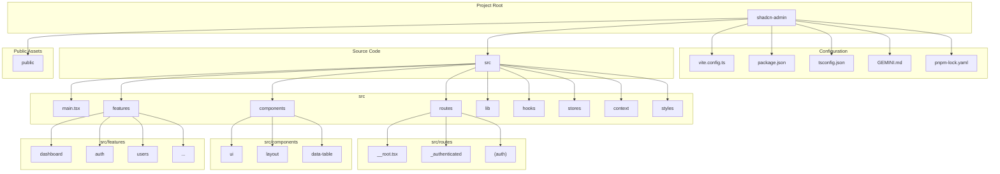

### Project Structure Explained

This project follows a modern frontend architecture using React and TypeScript, organized for scalability and maintainability.

#### **Root Directory**

*   `shadcn-admin/`: The root of the project.

#### **Configuration Files**

*   `vite.config.ts`: Configuration for Vite, the build tool and development server.
*   `package.json`: Lists project dependencies, scripts (like `dev`, `build`, `lint`), and metadata.
*   `pnpm-lock.yaml`: Ensures consistent dependency installation across different environments.
*   `tsconfig.json`: The main configuration file for the TypeScript compiler, defining how it should check your code.
*   `GEMINI.md`: A file providing context about the project for AI assistants like me.

#### **Asset Directories**

*   `public/`: Contains static assets like images and favicons that are served directly by the web server.

#### **Main Source Code (`src/`)**

This is where the core application logic resides.

*   `main.tsx`: The entry point of the React application. It renders the root component and sets up the main providers.
*   `routes/`: **File-based Routing**. This directory is the heart of the application's navigation, powered by TanStack Router. The folder structure inside `routes/` directly maps to the URL paths.
    *   `__root.tsx`: The root layout component for the entire application.
    *   `_authenticated/`: A layout route for pages that require a user to be logged in.
    *   `(auth)/`: A route group for authentication-related pages like sign-in and sign-up.
*   `components/`: Contains reusable React components shared across the application.
    *   `ui/`: Core UI components from the Shadcn/UI library (e.g., `Button`, `Card`, `Input`).
    *   `layout/`: Components related to the overall page structure, like the header, sidebar, and main content area.
    *   `data-table/`: Reusable components for building complex data tables.
*   `features/`: Organizes code into distinct business-logic domains or "features". This makes the codebase easier to manage as it grows.
    *   `dashboard/`: Contains all components and logic related to the main dashboard page.
    *   `auth/`: Holds components and logic for user authentication (sign-in, sign-up, etc.).
    *   `users/`: Manages the user-listing and user-profile features.
*   `lib/`: A collection of utility functions and helper code.
    *   `utils.ts`: General-purpose utility functions.
    *   `handle-server-error.ts`: A function to manage errors from the server.
*   `hooks/`: Custom React hooks that encapsulate and reuse stateful logic.
*   `stores/`: State management using Zustand. These files define "stores" for managing client-side state that can be accessed from any component.
*   `context/`: React Context providers for sharing state across the component tree (e.g., for theme, layout, or search state).
*   `styles/`: Global CSS files and styling configuration.
